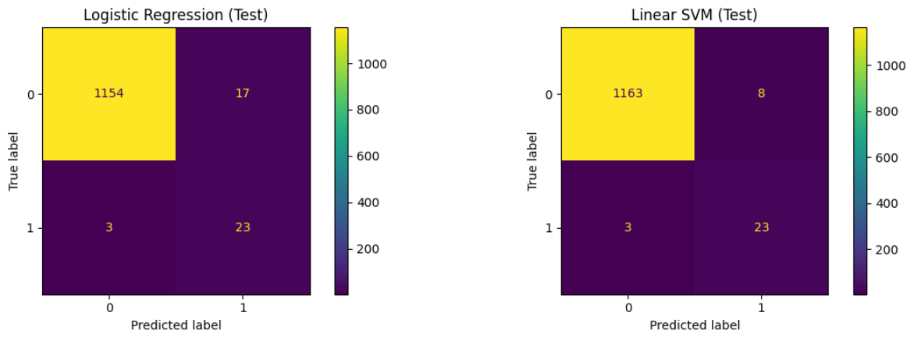
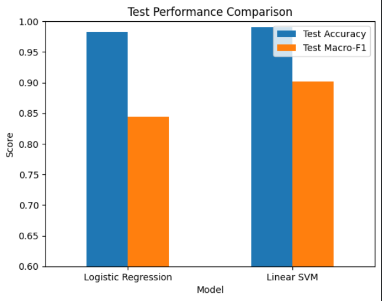

# EEG-Based Seizure Detection Using Machine Learning

Seizure vs. non-seizure classification on the **CHB-MIT scalp EEG** dataset (subject **chb01**).  
Pipeline: **4s windowing → bandpower features (Welch PSD) → Logistic Regression vs. Linear SVM**, evaluated with **time-ordered splits**.

## Key Takeaways
- **Linear SVM** achieved better overall performance on the held-out future test set (**Macro-F1 = 0.9012**) with fewer false positives.
- Because seizure windows are rare, we report **Macro-F1** in addition to accuracy to reflect performance on the minority class.

---

## Results (held-out test set)
- **Logistic Regression**: Accuracy **0.9833**, Macro-F1 **0.8442**
- **Linear SVM**: Accuracy **0.9908**, Macro-F1 **0.9012**

### Visual Results

**Confusion Matrices (Test Set)**  

**Test Performance Comparison (Accuracy + Macro-F1)**  

---

## Dataset
- **Dataset:** CHB-MIT Scalp EEG Database (subject **chb01**)
- **Source:** Kaggle mirror of CHB-MIT pediatric EEG (see References)
- **Data in this repo:** **NOT included** (EDF files are large). Please download separately.
- **Sampling rate:** **256 Hz**
- **Channels available:** **23 EEG derivations** per EDF file
- **Channel used (baseline):** **F7–T7 (Channel 2)** to reduce computation (engineering simplification)
- **Files used (7 seizure-containing EDFs):**  
  `chb01_03, chb01_04, chb01_15, chb01_16, chb01_18, chb01_21, chb01_26`

---

## Problem Setup
**Sample unit:** one 4-second EEG window (from the selected channel)  
**Label unit:** one binary label per window
- `1` = seizure (window overlaps an annotated seizure interval)
- `0` = non-seizure

---

## Feature Extraction (Bandpower)
For each 4-second window, we compute **Welch Power Spectral Density (PSD)** and convert the raw waveform into a small feature vector.

- **Features:** band powers in standard EEG bands: **delta, theta, alpha, beta**
- **Feature dimension:** **4** features per window
- **Implementation:** see the notebook for details

In short: **PSD → average/integrate power within each frequency band → features**.

---

## Models
- **Logistic Regression (L2)**
- **Linear SVM (LinearSVC)**

Both models use:
- **StandardScaler** for feature standardization
- **TimeSeriesSplit (walk-forward CV)** for hyperparameter tuning on the training portion only

---

## Evaluation (No Leakage)
- **Train/Test split:** time-ordered **80/20** (future is never used to predict the past)
- **Cross-validation:** walk-forward **TimeSeriesSplit** on training data
- **Metrics:** Accuracy, Macro-F1, Confusion Matrix

---

## How to Reproduce
1. Download the dataset (EDF + summary file) from Kaggle/PhysioNet.
2. Place EDF files under a local folder, e.g.
   - `chb01/chb01_03.edf`, ...
3. Open `EEG_SeizureDetection.ipynb`
4. Set `DATA_DIR` to your local path
5. Run all cells

---

## Repository Structure
- `EEG_SeizureDetection.ipynb` — main notebook (full pipeline)
- `assets/` — figures (confusion matrices, comparison plot)

---

## References
- [CHB-MIT Scalp EEG Database (PhysioNet)](https://physionet.org/content/chbmit/)
- [Kaggle mirror used in this project](https://www.kaggle.com/datasets/abhishekinnvonix/seizure-epilepcy-chb-mit-eeg-dataset-pediatric)
- [Scikit-learn documentation (LogisticRegression, LinearSVC, TimeSeriesSplit)](https://scikit-learn.org/stable/)
- [Welch PSD method (SciPy)](https://docs.scipy.org/doc/scipy/reference/generated/scipy.signal.welch.html)
- [Standard EEG frequency bands (background)](https://en.wikipedia.org/wiki/Electroencephalography)
